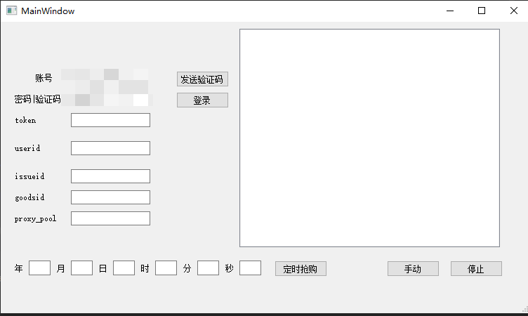

# pyqt抢购nft




```

# -*- coding: utf-8 -*-
import multiprocessing
import sys
import time
from PyQt5.QtCore import QThread, pyqtSignal
from PyQt5.QtWidgets import QApplication, QMainWindow
from qiankunui import Ui_MainWindow
import requests
import cgitb
from datetime import datetime
from apscheduler.schedulers.blocking import BlockingScheduler
from apscheduler.schedulers.qt import QtScheduler
from itertools import cycle

from requests.packages import urllib3

urllib3.disable_warnings()
cgitb.enable(format='text')


class MyMainForm(QMainWindow, Ui_MainWindow):
    def __init__(self, parent=None):
        super(MyMainForm, self).__init__(parent)
        self.setupUi(self)
        # 2.手动多线程发包
        self.work = WorkThread(self)
        self.start.clicked.connect(self.execute)
        self.stop.clicked.connect(self.stoping)

        # 1.登录
        self.ui_login = Login(self)
        self.login.clicked.connect(self.start_login)

        # 3.auto
        self.auto_buy.clicked.connect(self.auto_buy1)

    def auto_buy1(self):
        self.work.auto_buy()
        self.work.trigger.connect(self.display)

    def start_login(self):
        self.ui_login.start()
        self.ui_login.trigger.connect(self.display)

    def stoping(self):
        self.work.stop()
        self.work.trigger.connect(self.display)

    def execute(self):
        # 启动线程
        self.work.start()
        # 线程自定义信号连接的槽函数
        self.work.trigger.connect(self.display)

    def display(self, str):
        # 由于自定义信号时自动传递一个字符串参数，所以在这个槽函数中要接受一个参数
        self.listWidget.addItem(str)


class Login(QThread):
    trigger = pyqtSignal(str)

    def __init__(self, demo):
        super(Login, self).__init__()
        self.demo = demo

    def run(self):
        username = self.demo.username.text().strip()
        password = self.demo.password.text().strip()

        try:
            burp0_url = "https://x.com"
            burp0_headers = {"Sec-Ch-Ua": "\"(Not(A:Brand\";v=\"8\", \"Chromium\";v=\"101\"", "Sid": "35001800000",
                             "Sec-Ch-Ua-Mobile": "?0",
                             "User-Agent": "Mozilla/5.0 (Windows NT 10.0; Win64; x64) AppleWebKit/537.36 (KHTML, like Gecko) Chrome/101.0.4951.54 Safari/537.36",
                             "Content-Type": "application/x-www-form-urlencoded", "Newversion": "H5_1.0",
                             "Sec-Ch-Ua-Platform": "\"Windows\"", "Source": "218", "Accept": "*/*",
                             "Origin": "http://nt.fengkuangtiyu.cn", "Sec-Fetch-Site": "cross-site",
                             "Sec-Fetch-Mode": "cors", "Sec-Fetch-Dest": "empty",
                             "Referer": "http://nt.fengkuangtiyu.cn/",
                             "Accept-Encoding": "gzip, deflate", "Accept-Language": "zh-CN,zh;q=0.9",
                             "Connection": "close"}
            burp0_data = {"phone": f"{username}", "loginPwd": f"{password}"}
            res = requests.post(burp0_url, headers=burp0_headers, data=burp0_data, verify=False)
        except Exception as e:
            print(e)

        res_json = res.json()
        print(res_json["data"]["loginSign"])

        self.trigger.emit(res.text)
        self.demo.token.setText(res_json["data"]["loginSign"])
        self.demo.userid.setText(res_json["data"]["userId"])


class WorkThread(QThread):
    # 自定义信号对象。参数str就代表这个信号可以传一个字符串
    trigger = pyqtSignal(str)

    def __init__(self, demo):  # 3
        super(WorkThread, self).__init__()
        self.demo = demo
        self.pool = None

    def callback(self, x):
        self.trigger.emit(x)

    # 主要启动函数
    def run(self):
        # 重写线程执行的run函数
        # 触发自定义信号

        userid = self.demo.userid.text().strip()
        token = self.demo.token.text().strip()
        goodsid = self.demo.goodsid.text().strip()
        issueid = self.demo.issueid.text().strip()
        _proxy = self.demo.proxy_pool.text().strip()
        try:
            res = requests.get(_proxy)
            self.ips = res.text.splitlines()

        except Exception as e:
            print(e)

        self.pool = multiprocessing.Pool()
        for ip in cycle(self.ips):
            self.pool.apply_async(self.work, (userid, token, goodsid, issueid, ip), error_callback=self.callback,
                                  callback=self.callback)
        self.pool.close()
        self.pool.join()

    @staticmethod
    def work(userid, token, goodsid, issueid, ip=None):
        proxies = {"http": ip, "https": ip}
        burp0_url = "https://x"
        burp0_headers = {"Sec-Ch-Ua": "\"(Not(A:Brand\";v=\"8\", \"Chromium\";v=\"101\"", "Sid": "35001800000",
                         "Sec-Ch-Ua-Mobile": "?0",
                         "User-Agent": "Mozilla/5.0 (Windows NT 10.0; Win64; x64) AppleWebKit/537.36 (KHTML, like Gecko) Chrome/101.0.4951.54 Safari/537.36",
                         "Content-Type": "application/x-www-form-urlencoded", "Newversion": "H5_1.0",
                         "Loginsign": f"{token}", "Sec-Ch-Ua-Platform": "\"Windows\"",
                         "Source": "218", "Accept": "*/*", "Origin": "http://nt.fengkuangtiyu.cn",
                         "Sec-Fetch-Site": "cross-site", "Sec-Fetch-Mode": "cors", "Sec-Fetch-Dest": "empty",
                         "Referer": "http://nt.fengkuangtiyu.cn/", "Accept-Encoding": "gzip, deflate",
                         "Accept-Language": "zh-CN,zh;q=0.9", "Connection": "close"}
        burp0_data = {"userId": f"{userid}", "goodsId": f"{goodsid}", "issueId": f"{issueid}"}
        try:
            res = requests.post(burp0_url, headers=burp0_headers, data=burp0_data, proxies=proxies)
        except:
            pass
        time.sleep(0.1)
        # 通过自定义信号把待显示的字符串传递给槽函数
        print(res.text)
        return res.text

    # 停止
    def stop(self):
        print('stop')
        self.pool.terminate()

        self.is_running = False
        self.terminate()
        self.trigger.emit("stop")

    # 定时抢购
    def auto_buy(self):
        ss = self.demo.ss.text().strip()
        y = self.demo.year.text().strip()
        mon = self.demo.mon.text().strip()
        days = self.demo.days.text().strip()
        hours = self.demo.hours.text().strip()
        mins = self.demo.mins.text().strip()

        scheduler = QtScheduler()
        scheduler.add_job(self.run, 'date',
                          run_date=datetime(int(y), int(mon), int(days), int(hours), int(mins), int(ss)),
                          )

        scheduler.start()


if __name__ == "__main__":
    app = QApplication(sys.argv)
    myWin = MyMainForm()
    myWin.show()
    sys.exit(app.exec_())

```